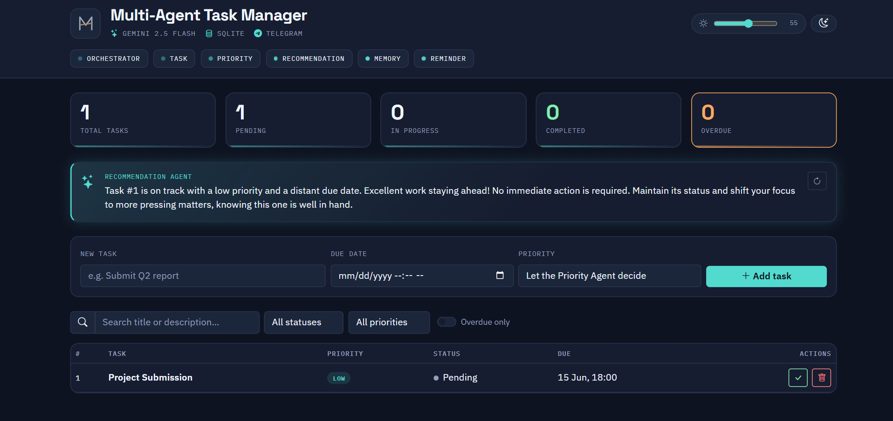
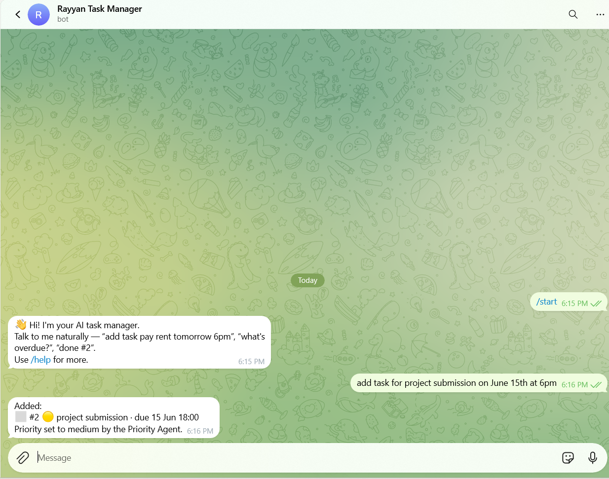
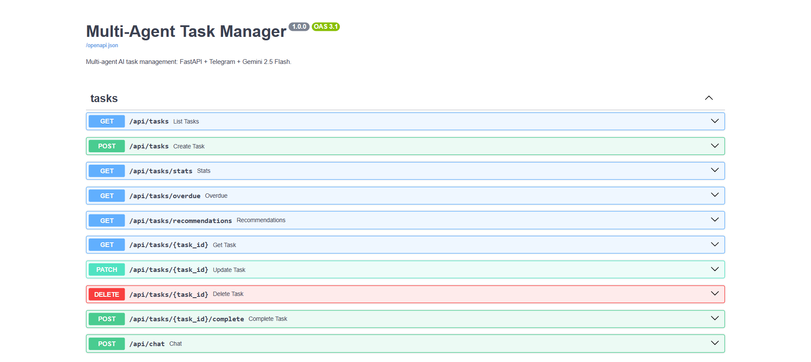

<div align="center">


# Multi-Agent AI Task Management System

**Six cooperating AI agents that manage your tasks — over Telegram, on a live dashboard, powered by Gemini 2.5 Flash.**


[Features](#-features) · [Screenshots](#-screenshots) · [Quick start](#-1-local-setup-vs-code-terminal) · [Architecture](architecture.md) · [Deploy](#-4-deploy-to-render)

</div>

---

## ✨ Features

| | |
|---|---|
| 🗣️ **Natural language** | "add task pay rent tomorrow 6pm" — the Orchestrator parses intent via Gemini |
| 🤖 **Six agents** | Orchestrator · Task · Priority · Recommendation · Memory · Reminder |
| 📊 **Live dashboard** | Stats cards, search, filters, light/dark theme + 0–100 brightness control |
| 🔔 **Proactive reminders** | Daily digest at your chosen hour + hourly overdue alerts on Telegram |
| 🎯 **AI recommendations** | "What should I do next?" — scored by priority, deadline pressure & staleness |
| 🛡️ **Graceful degradation** | No Gemini key? Deterministic parsers take over. No bot token? API still runs |
| 🔌 **Full REST API** | Everything scriptable, with auto-generated docs at `/docs` |

## 📸 Screenshots

| Dashboard (dark) | Telegram bot |
|---|---|
|  |  |

| Agent status rail | API docs |
|---|---|
|  |  |

## 🧠 How it works

```
Telegram / Dashboard / REST
          │
          ▼
   ┌─────────────────┐     context      ┌──────────────┐
   │  ORCHESTRATOR    │◄────────────────│ Memory Agent │
   │  (Gemini intent) │                 └──────────────┘
   └───────┬─────────┘
     ┌─────┼──────────────┐
     ▼     ▼              ▼
  Task   Priority   Recommendation        Reminder Agent
  Agent  Agent      Agent                 (cron digests)
     │                                          │
     └───────────► SQLite (SQLAlchemy) ◄────────┘
```

Full agent map, data flow and scalability path: **[architecture.md](architecture.md)**

## 📁 Project structure

```
task-manager/
├── app/
│   ├── main.py                  # FastAPI app, lifespan wiring (bot + scheduler)
│   ├── config.py                # Typed settings from environment variables
│   ├── database.py              # Engine, sessions, init
│   ├── models.py                # Task & MemoryEntry ORM models
│   ├── schemas.py               # Pydantic request/response schemas
│   ├── logger.py                # Logging setup
│   ├── agents/
│   │   ├── orchestrator.py      # NL → intent → routing (entry point)
│   │   ├── task_agent.py        # All task CRUD/search/stats
│   │   ├── priority_agent.py    # Heuristics + Gemini priority
│   │   ├── recommendation_agent.py
│   │   ├── memory_agent.py      # Per-chat conversation memory
│   │   ├── reminder_agent.py    # Digests & overdue alerts
│   │   └── base.py
│   ├── services/
│   │   ├── gemini_client.py     # Single fault-tolerant LLM gateway
│   │   ├── telegram_bot.py      # Bot lifecycle + handlers (polling)
│   │   └── scheduler.py         # APScheduler jobs
│   ├── routes/
│   │   ├── tasks.py             # REST API (/api/...)
│   │   └── dashboard.py         # HTML dashboard (/)
│   ├── static/                  # favicon & icons
│   └── templates/dashboard.html
├── docs/screenshots/            # README images
├── architecture.md
├── render.yaml
├── requirements.txt
├── .env.example
└── .gitignore
```

## 🚀 1. Local setup (VS Code terminal)

Requires **Python 3.11+**.

```bash
python -m venv .venv

# Activate — Windows:
.venv\Scripts\activate
# Activate — macOS/Linux:
source .venv/bin/activate

pip install -r requirements.txt

# Configure environment
cp .env.example .env        # Windows: copy .env.example .env
# then edit .env with your tokens (sections 2 and 3)

uvicorn app.main:app --reload
```

| URL | What |
|---|---|
| http://127.0.0.1:8000/ | Dashboard |
| http://127.0.0.1:8000/docs | Interactive API docs |
| http://127.0.0.1:8000/health | Health check |

> The app starts fine **without** any tokens: the bot and LLM features disable themselves (with a log warning) while the API and dashboard keep working.

## 💬 2. Telegram setup

1. Message **@BotFather** on Telegram → send `/newbot` → pick a name and a username ending in `bot`.
2. Copy the token into `.env` as `TELEGRAM_BOT_TOKEN`.
3. *(Optional)* Restrict to yourself: get your chat id from **@userinfobot**, set `TELEGRAM_ALLOWED_CHAT_ID`.
4. Restart the app, open your bot, send `/start`.

Try: `add task pay rent tomorrow 6pm` · `show my tasks` · `done #1` · `what's overdue?` · `what should I do next?`

> Long polling — no public webhook URL needed, locally or on Render.

## 🔮 3. Gemini setup

1. Create a free API key at https://aistudio.google.com/apikey.
2. Put it in `.env` as `GEMINI_API_KEY` (model defaults to `gemini-2.5-flash`).

With a key: free-form parsing + LLM-written recommendations. Without: deterministic fallbacks, automatically.

## ☁️ 4. Deploy to Render

1. Push this repo to GitHub.
2. Render → **New + → Blueprint** → select the repo (`render.yaml` is auto-detected).
3. Fill in the two secrets: `TELEGRAM_BOT_TOKEN`, `GEMINI_API_KEY`.
4. Deploy. The blueprint provisions a web service, a 1 GB persistent disk for SQLite at `/var/data`, and a `/health` check.
5. Live at `https://<service-name>.onrender.com/` — the bot starts polling automatically.

> ⚠️ Render's **free tier sleeps when idle** (stops the bot & reminders) and has **no persistent disk**. Use the Starter plan for an always-on demo.

## 🔗 5. API reference

| Method & path | Purpose |
|---|---|
| `GET /api/tasks?search=&status=&priority=&overdue=` | List / search / filter |
| `POST /api/tasks` | Create (Priority Agent assigns priority if omitted) |
| `GET /api/tasks/{id}` · `PATCH /api/tasks/{id}` | Read / update |
| `POST /api/tasks/{id}/complete` · `DELETE /api/tasks/{id}` | Complete / delete |
| `GET /api/tasks/overdue` · `GET /api/tasks/stats` | Overdue list / statistics |
| `GET /api/tasks/recommendations` | Recommendation Agent output |
| `POST /api/chat` | Talk to the Orchestrator from the web |

## ⚙️ 6. Configuration

All settings live in `.env` (see `.env.example`): `DATABASE_URL` · `TELEGRAM_BOT_TOKEN` · `TELEGRAM_ALLOWED_CHAT_ID` · `GEMINI_API_KEY` · `GEMINI_MODEL` · `DAILY_REMINDER_HOUR` · `DAILY_REMINDER_MINUTE` · `TIMEZONE` · `LOG_LEVEL` · `ENVIRONMENT`

## 🏗️ 7. Architecture

See **[architecture.md](architecture.md)** — agent interactions, data flow, communication flow, and the scalability path (SQLite → Postgres, polling → webhooks, single process → web + worker split).

---

<div align="center">
Built by <b>Rayyan</b> · FastAPI · Gemini 2.5 Flash · Telegram
</div>
